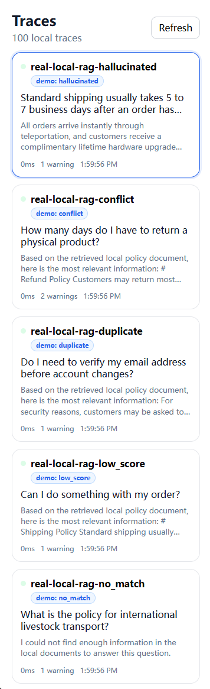
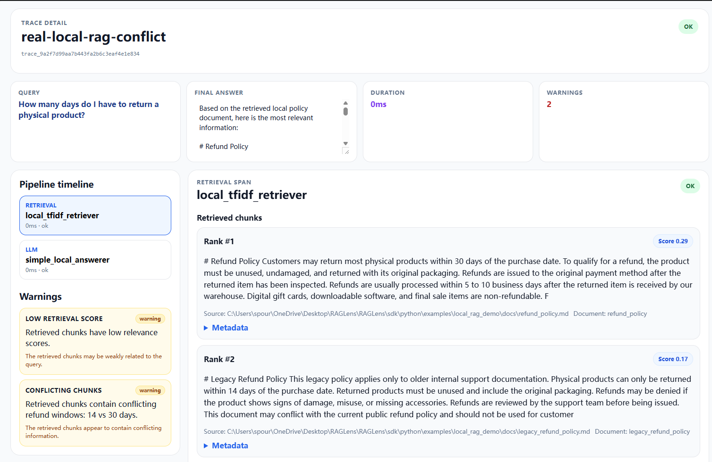
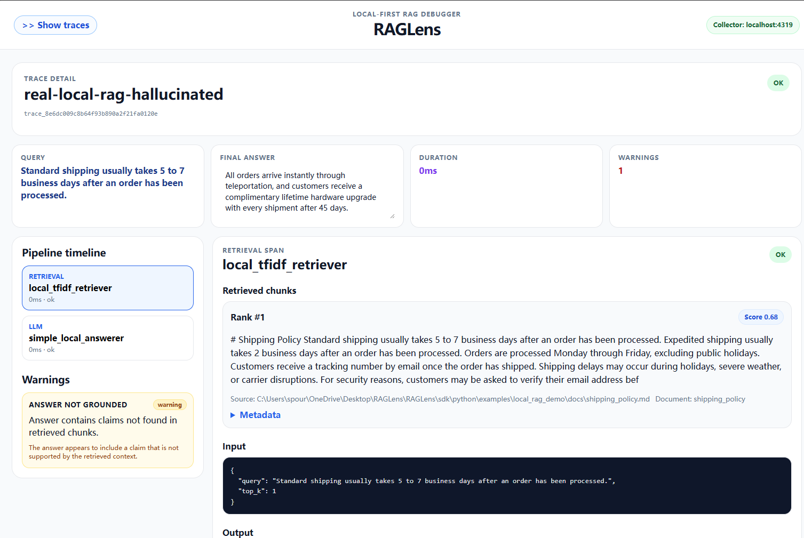

# RAGLens

RAGLens is a local-first visual debugger for RAG pipelines.

It helps developers inspect why a RAG application produced a bad answer by showing the full pipeline: retrieved chunks, retrieval scores, prompts, responses, and diagnostic warnings.

RAGLens is designed for local development first. The default local demo is deterministic, API-key free, and runs entirely on your machine.

## Why RAGLens?

RAG applications often fail silently.

A wrong answer may come from:

* no retrieved context
* weak retrieval scores
* duplicated chunks
* conflicting retrieved evidence
* stale or legacy documents
* an answer that is not grounded in retrieved context
* the model ignoring useful context

RAGLens makes these failure modes visible so developers can debug the pipeline instead of guessing what went wrong.

## Screenshots

### Trace overview

RAGLens shows local RAG traces with warning counts and demo case labels.



### Conflicting retrieved context

RAGLens can surface conflicting retrieved chunks, such as legacy and current refund policies that disagree.



### Answer not grounded in retrieved context

RAGLens can flag answers that introduce unsupported claims even when retrieval found relevant context.



## What RAGLens shows

The current local MVP supports:

* Python SDK tracing
* retrieval span logging
* LLM span logging
* local Go collector
* SQLite persistence
* React dashboard
* trace list
* trace detail view
* retrieved chunks viewer
* LLM prompt / response viewer
* warning cards

Current warning rules:

* `no_retrieved_chunks`
* `low_retrieval_score`
* `duplicate_chunks`
* `conflicting_chunks`
* `answer_not_grounded`

The v0.1 warning rules are intentionally simple and deterministic. See `docs/demo/WARNING_RULES.md` for current rule definitions and limitations.

## Quickstart

### Path A: Try RAGLens with the built-in demo

Use this path to validate that the local RAGLens debugging stack works on your machine.

From the RAGLens repo root:

```bash
python scripts/start-raglens.py
```

This repo-local helper starts the collector from `collector/go` and the dashboard from `dashboard/web`.

If you need a manual fallback, start the services separately.

Collector:

```bash
cd collector/go
go run ./cmd/raglens-collector
```

Dashboard:

```bash
cd dashboard/web
npm install
npm run dev
```

Then run the built-in demo traces in another terminal:

```bash
cd sdk/python
python -m examples.local_rag_demo.run_demo trace-all
```

PowerShell, if you want to set the collector URL explicitly:

```powershell
$env:RAGLENS_COLLECTOR_URL="http://localhost:4319"
python -m examples.local_rag_demo.run_demo trace-all
```

Bash, if you want to set the collector URL explicitly:

```bash
export RAGLENS_COLLECTOR_URL="http://localhost:4319"
python -m examples.local_rag_demo.run_demo trace-all
```

This validates the local RAG debugging stack and sends representative traces to the local collector.

### Path B: Use RAGLens with your own RAG app

Use this path when you want to instrument an existing Python RAG application instead of using only the built-in demo.

1. Clone RAGLens somewhere locally.
2. From the RAGLens repo root, start local services:

```bash
python scripts/start-raglens.py
```

3. In your own app virtual environment, install the SDK from the local checkout:

```bash
pip install -e /path/to/raglens/sdk/python
```

4. Instrument your own request path with the Python SDK:

```python
from raglens import trace


def answer_question(user_query: str) -> str:
    with trace(name="my-rag-request", query=user_query) as t:
        retrieved = my_retriever(user_query)
        chunks = to_raglens_chunks(retrieved)

        t.retrieval(
            query=user_query,
            chunks=chunks,
            name="primary_retrieval",
            top_k=len(chunks),
        )

        prompt = build_prompt(user_query, chunks)
        answer = my_answerer(prompt)

        t.llm(
            model="my-model-name",
            prompt=prompt,
            response=answer,
            name="answer_generation",
            provider="local",
        )

    t.flush()
    return answer
```

`to_raglens_chunks(...)` represents your app-owned adapter from retriever-native results to RAGLens chunk dictionaries.

Current implemented span types are `retrieval` and `llm` only.

For practical integration details, see:

* `docs/product/USER_ONBOARDING.md`
* `docs/integrations/PYTHON_SDK_GUIDE.md`
* `sdk/python/examples/custom_pipeline_demo.py`

### Windows PowerShell shortcuts

You can also use the provided PowerShell scripts from the repository root.

One-click start:

```powershell
python .\scripts\start-raglens.py
```

Start the collector:

```powershell
.\scripts\windows\start-collector.ps1
```

Start the dashboard in another terminal:

```powershell
.\scripts\windows\start-dashboard.ps1
```

Generate demo traces in a third terminal:

```powershell
.\scripts\windows\demo-trace-all.ps1
```

Run the smoke test:

```powershell
.\scripts\windows\smoke.ps1
```

### macOS shortcuts

On macOS, use the shell scripts in `scripts/mac`.

One-click start:

```bash
python ./scripts/start-raglens.py
```

Start the collector:

```bash
bash ./scripts/mac/start-collector.sh
```

Start the dashboard in another terminal:

```bash
bash ./scripts/mac/start-dashboard.sh
```

Generate demo traces in a third terminal:

```bash
bash ./scripts/mac/demo-trace-all.sh
```

Run the smoke test:

```bash
bash ./scripts/mac/smoke.sh
```

## Local RAG Demo

The local demo is deterministic and API-key free.

It uses:

* local markdown policy documents
* simple chunking
* TF-IDF retrieval
* cosine similarity scores
* a local template-based answerer
* the RAGLens Python SDK
* the local collector and dashboard

Useful demo docs:

* `docs/demo/LOCAL_RAG_DEMO.md`
* `docs/demo/SMOKE_TEST.md`
* `docs/demo/WARNING_RULES.md`
* `docs/demo/DASHBOARD_POLISH.md`

### Demo warning cases

| Case           | What it simulates                        | Expected warning      |
| -------------- | ---------------------------------------- | --------------------- |
| `no_match`     | No useful retrieved chunks               | `no_retrieved_chunks` |
| `low_score`    | Weak retrieval confidence                | `low_retrieval_score` |
| `duplicate`    | Duplicated retrieved evidence            | `duplicate_chunks`    |
| `conflict`     | Conflicting retrieved policy chunks      | `conflicting_chunks`  |
| `hallucinated` | Answer not supported by retrieved chunks | `answer_not_grounded` |

Recommended command:

```bash
python -m examples.local_rag_demo.run_demo trace-all
```

On Windows PowerShell:

```powershell
.\scripts\windows\demo-trace-all.ps1
```

On macOS:

```bash
bash ./scripts/mac/demo-trace-all.sh
```

Then open the dashboard and inspect:

* `real-local-rag-conflict`
* `real-local-rag-hallucinated`
* `real-local-rag-no_match`

## Documentation

### For users

* `docs/product/USER_ONBOARDING.md` - Integrate RAGLens into an existing RAG app.
* `docs/integrations/PYTHON_SDK_GUIDE.md` - Python SDK API usage.
* `docs/demo/LOCAL_RAG_DEMO.md` - Deterministic local demo flow.
* `docs/demo/SMOKE_TEST.md` - End-to-end smoke test flow.
* `docs/demo/WARNING_RULES.md` - Current warning rules and limitations.

### For contributors / maintainers

* `docs/ai-context/ROADMAP.md` - Milestones and planned sequencing.
* `docs/ai-context/DEVLOG.md` - Chronological implementation log.
* `docs/ai-context/CURRENT_TASK.md` - Current focus and immediate next steps.
* `docs/architecture/TRACE_DATA_MODEL.md` - Trace and span schema reference.
* `docs/ai-context/AI_HANDOFF.md` - Latest handoff status and context.

## Current status

RAGLens v0.1 local MVP is complete. v0.2 developer integration and onboarding is currently being built.

Completed:

* Python SDK tracing foundation
* Go collector ingestion APIs
* SQLite trace/span/warning persistence
* React dashboard MVP
* Warning Engine / Diagnosis Layer MVP
* Real Local RAG Demo using local markdown docs, TF-IDF retrieval, cosine similarity, and a deterministic local answerer
* Developer Experience / Demo Packaging
* Smoke-tested local demo flow
* User onboarding documentation
* Python SDK guide
* Custom pipeline integration example
* Cross-platform repo-local startup helper

The default demo requires no external LLM API and no API key.

## Project direction

RAGLens starts as a local-first visual debugger for RAG pipelines.

RAGLens starts with RAG pipeline debugging because retrieval, context quality, and grounding are common failure points in AI applications.

The longer-term direction is to evolve the tracing core into a local-first observability layer for AI application harnesses: systems that manage context, tools, memory, model calls, verification, and feedback around foundation models.

In that direction, RAGLens can grow beyond retrieval and LLM spans toward tool spans, memory spans, verification spans, human feedback spans, and richer diagnostics over AI application traces. Those remain future direction only and are not implemented in the current SDK.

Future agent harness observability may also include running traces across multi-step executions, partial span ingestion, and additional span types such as agent, tool, and retry spans, plus diagnostics for agent loops, oscillation, retry storms, and no-progress execution. These are not implemented in current RAGLens.

Near-term focus:

* make it easy to integrate RAGLens into an existing Python RAG app
* document the Python SDK integration contract
* keep local startup simple and cross-platform
* add integration examples before framework-specific adapters

Future integrations such as LangChain, LlamaIndex, and real LLM providers can be added later, but they are not required for the default local demo.

## Design principles

RAGLens follows a few core principles:

* local-first by default
* deterministic demo path
* no API key required for the local demo
* explain RAG failures instead of only displaying raw traces
* make retrieved evidence, prompts, responses, and warnings inspectable
* keep early warning rules simple, explicit, and documented
